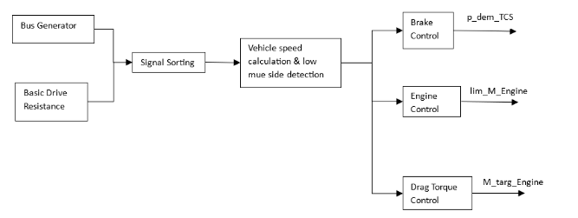

⭐ **1. Introduction**

Modern commercial vehicles are equipped with a wide range of Driver Assistance Systems (DAS) designed to improve vehicle safety, stability, and operational efficiency. Advances in Model-Based Development (MBD) and vehicle dynamics simulation enable these systems to be developed, calibrated, and validated in virtual environments across a broad spectrum of real-world driving scenarios before deployment to production hardware.

This project focuses on the development of multiple DAS functionalities within the Electronic Braking System (EBS) architecture of commercial vehicles using MATLAB/Simulink. In addition, an automated Verification & Validation (V&V) framework is implemented to execute simulation-based test campaigns, evaluate system performance, and generate validation reports through co-simulation workflows.

<table>
  <tr>
    <td align="center">
      <b></b><br>
      
    </td>
  </tr>
</table>

---

🔒 **2. Project Availability & Confidentiality**

This project was developed in collaboration with a leading German commercial vehicle OEM. Due to confidentiality agreements and the proprietary nature of the MATLAB/Simulink and IPG TruckMaker models, the original implementation, simulation assets, calibration data and test environments cannot be publicly shared.

To demonstrate the technical scope of the work, this repository provides system architecture diagrams, workflow illustrations, pseudo-codes  , validation methodologies, and conceptual dashboards that mirror the development and testing process. The objective is to showcase practical experience in Systems Engineering, Model-Based Development (MBD), co-simulation, and automated V&V workflows while fully respecting intellectual property and confidentiality requirements.

---

⚙️ **3. Service Brake System (SBS)**

**Input**
- Driver deceleration demand  
- Vehicle configuration parameters  

**Output**
- Brake pressure demand per wheel 

**Function** <br>
Computes required braking performance by translating driver deceleration demand into brake force level (BFL) and brake force distribution (BFD), including trailer braking coordination. Generates wheel-level brake pressure requests for downstream EBS actuation.

---

⚙️ **4. Traction Control System (TCS)**

The TCS is structured into three core control functions within the vehicle dynamics control architecture: Engine Control, Brake Control, and Drag Torque Control.

**Input**
- Driven and non-driven wheel speeds  
- Vehicle speed and acceleration state  
- Road friction estimate (μ / “mu”)  
- Differential lock status  
- Gear shift / driveline state  

**Output**
- Engine torque reduction request  
- Individual wheel brake pressure (selective braking)  
- Engine torque increase request (drag torque compensation)  

**Function** <br>
Prevents wheel slip and instability during low-μ or split-μ driving conditions by coordinating engine torque and brake interventions. Compares wheel speed differentials across axles to detect slip, then applies engine torque limitation, selective wheel braking (active up to ~40 km/h), or drag torque compensation during downshifts to maintain traction and vehicle stability.

A simplified architecture diagram of the TCS implementation is shown below.

<p align="center">
  
</p>

---

⚙️ **5. Electronic Stability Program (ESP) - Pre YRC Deployment**


**Input**
- ESP sensor signals (wheel speeds, brake pressures, yaw rate, longitudinal acceleration, gear ratio)  
- Ideal reference signals from TruckMaker (friction coefficient, trailer articulation angle)  
- Vehicle geometry parameters  

**Output**
- Desired yaw rate of the driver corrected for road banking, filtered for noise and milied by road friction coefficient. 

**Function** <br> 
Prepares and structures all vehicle, sensor, and simulation inputs into dedicated signal buses for stability control. A reference model computes driver-desired yaw rate using a single-track vehicle model, followed by bank compensation, signal filtering (DD filter), and μ-limited yaw rate constraint. The resulting corrected yaw reference is used as the input for downstream Yaw Control (YRC) and Roll Stability Program (RSP) functions.

---

⚙️ **6. Yaw Rate Controller (YRC)**

The Yaw Rate Controller (YRC) is a vehicle stability function that detects deviations between driver-demanded and actual yaw behavior and intervenes through engine torque reduction, selective braking, and slip control. Its activation is governed by dynamic tolerance bands that account for vehicle speed, μ-split conditions, and road banking to ensure stable yet non-intrusive control intervention.

A simplified architecture view of the developed Yaw Rate Controller (YRC) is shown below, illustrating its activation logic, state classification, and intervention strategy based on driver yaw demand and vehicle dynamic feedback.

NOTE: The tolerance band defines the allowable deviation between desired and actual yaw rate within which no intervention is triggered; it is dynamically adjusted based on vehicle speed, μ-split conditions, road banking, and steering state.

```mermaid
flowchart TD

A[Inputs: yaw demand, actual yaw rate, vehicle speed, mu split, banking] --> B[Yaw rate error calculation]

B --> C{Vehicle speed below 20 kmph}

C -->|Yes| C1[Deactivate YRC - set error zero]
C -->|No| D[Tolerance band evaluation]

D --> E{Dynamic tolerance band check and widening  - mu split, banking, steering state}

E --> F{Check if yaw rate error exceeds defined tolernace band}

F -->|No| F1[YRC inactive]
F -->|Yes| G[YRC activated]

G --> H[Vehicle state classification understeer/oversteer]

H --> I[PID controller stabilizing yaw moment]

I --> J[Intervention strategy]

J --> J1[Engine torque reduction APP zero]
J --> J2[Wheel specific brake pressure]
J --> J3[Slip limitation logic]
J --> J4[Trailer brake coordination]

J --> K[Vehicle stability output]

E -. interaction .-> L[ABS mu split control module triggered]
